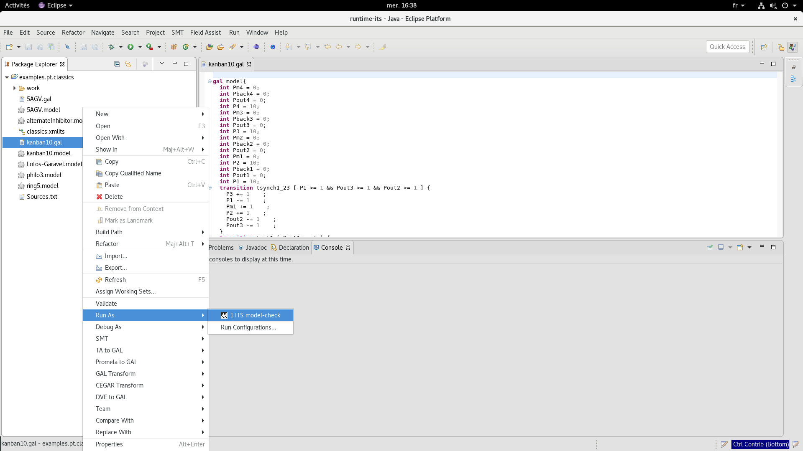
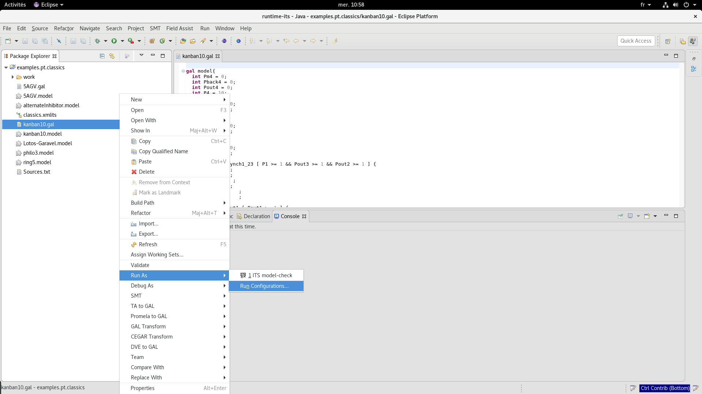
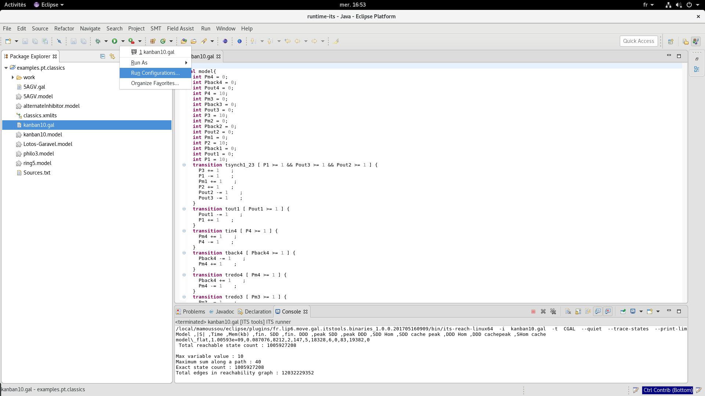
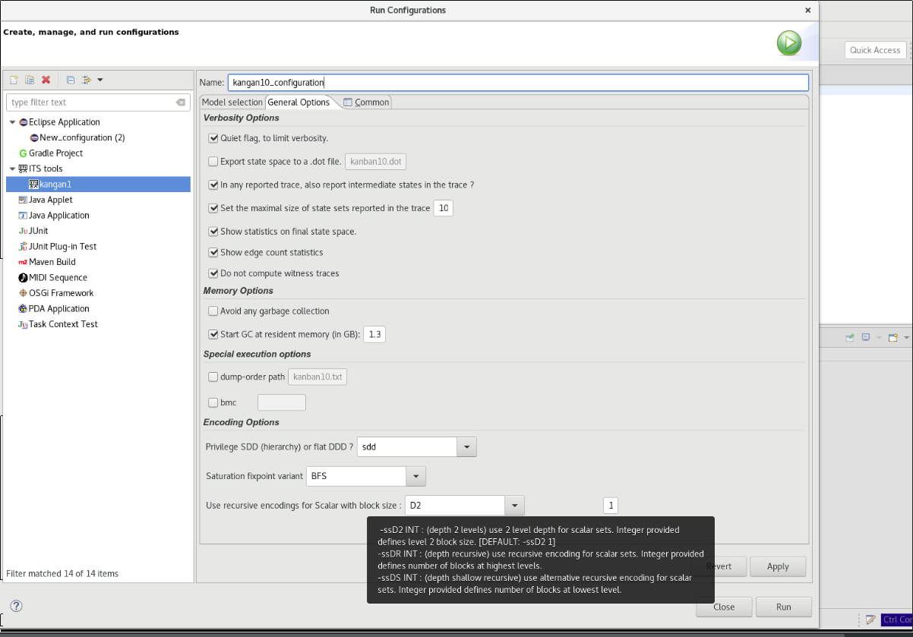
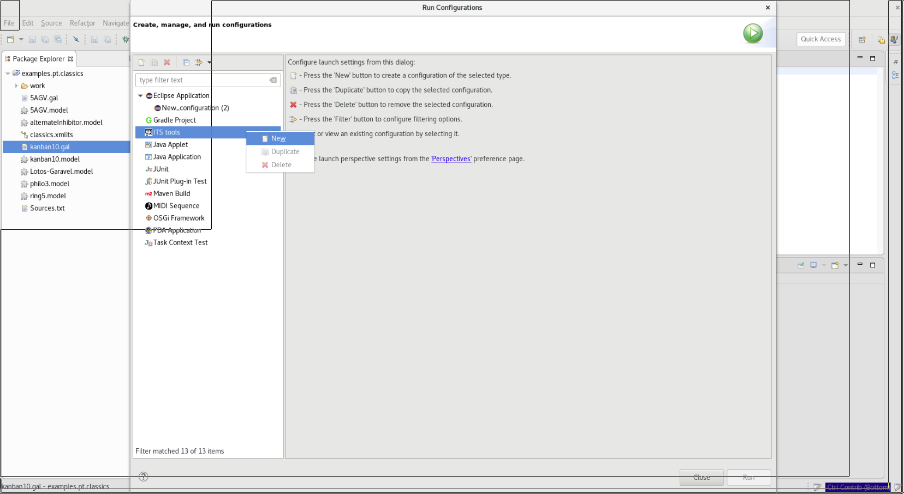
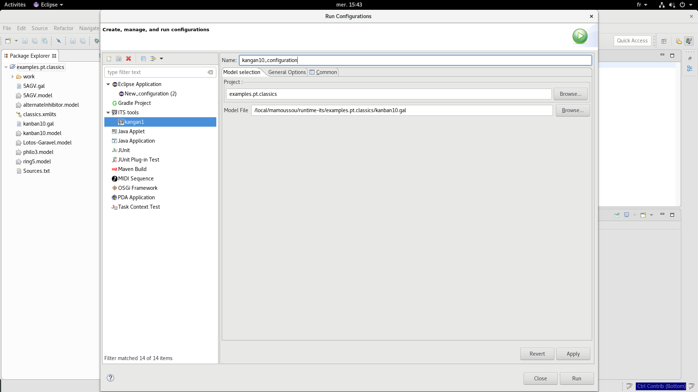

How to run ITS_Tools from Eclipse?
=================================================

This documentation aims to show you an interactive way to run ITS_Tools from Eclipse.

Consider that we intend to run the file *kangan10.gal*. This you may do by:

  * Running it directly with the *default options values* as they have been specified or by
  * Configuring it first accordingly to your purposes before the running.
  

1.  The *right click* method:

  You can perform it as described below:
  
  

2.  Running after Configuring
   
   *  Open the Eclipse Configuration window
   
      **First way :** (right) click on the file *kangan10.gal* -> *Run As* -> *Run Configurations...*
      
      

      **Second way :** Open the Run combo-box icon in the toolbar -> click Run Configurations...
      
      

   *  In the General Options tab, configure the tool according to your will

      

   *  click *Run*.
   
   
   
   It is also possible to create manually a new configuration by following the steps below:
   
   Right click on *ITS Tools* menu -> click *New* 
   
   

    Then *Edit the configuration name and select a project and a model file (see Model Selection tab)*
   
   

   
   
   
3.  Reference Manual for Options (retained in the General Options tab)

Several options have been chosen among all those available in the command-line its-tools version.
They are:
+ Input options (mandatory):
----------------------------
    
    -i path : specifies the path to the input model file.
    
    -t {CAMI|PROD|ROMEO|ITSXML|ETF|DVE|GAL|DLL|NDLL} : specifies format of the input model file :
    
        CAMI : CAMI format (for P/T nets) is the native Petri net format of CPN-AMI
        PROD : PROD format (for P/T nets) is the native format of PROD
        ROMEO : an XML format (for Time Petri nets) that is the native format of Romeo
        ITSXML : a native XML format (for ANY kind of ITS) for this tool. These files allow to point to other files and are used as main file for composite definitions. See this example, the list of formalism/format supported is described here.
        ETF : Extended Table Format is the native format used by LTSmin, built from many front-ends.
        DVE : Divine is a modelling language similar to Promela. Input file should be in Divine format.
        GAL : Guarded Action Language. Input file should be in GAL syntax.
        DLL : use a dynamic library that provides a function "void loadModel (Model &,int)" typically written using the manipulation APIs. See demo/ folder.
        NDLL : same as DLL, but expect input formatted as size:lib.so. See demo/ folder for a usage example. Both DLL and NDLL are used to inject of arbitrary C++ ITS types into the ITSModel.
        
       
+ An option related to Variable Order:
------------------------------------

    --dump-order path : dump the currently used variable order to file designated by path and exit. 
    
 + Options related to Encoding of ITS types
 -------------------------------------------
 
    For Petri nets, there is a choice between an SDD encoding, where to each variable is associated the set of integer values it can take, or a DDD encoding, where each edge of the decision diagram is labeled by a single value (i.e. like MDD). The default used is the SDD encoding, but option --ddd sometimes works better when markings (or transition latest firing times) have large values.

    --sdd : privilege SDD storage (Petri net models only).[DEFAULT]
    --ddd : privilege DDD (no hierarchy) encoding (Petri net models only).

    For Scalar and Circular symmetric composite types, the following options allow to use recursive state encodings. The default setting is "-ssD2 1", i.e. for a Scalar or Circular set of size n, define n SDD variables, one per subcomponent.

    -ssD2 INT :[DEFAULT: -ssD2 1] (depth 2 levels) use 2 level depth for scalar sets. Integer provided defines level 2 block size.
    -ssDR INT : (depth recursive) use recursive encoding for scalar sets. Integer provided defines number of blocks at highest levels.
    -ssDS INT : (depth shallow recursive) use alternative recursive encoding for scalar sets. Integer provided defines number of blocks at lowest level.

+ Options related to gc policy
-------------------------------

     Garbage collection options :
        --no-garbage : disable garbage collection (may be faster, more memory)
        --gc-threshold INT : set the threshold for first starting to do gc [DEFAULT:13000 kB=1.3GB] 
        
 + Options related to saturation
 --------------------------------
 
     Two variants of saturation are possible, controlling how clusters are applied at a given level. The BFS variant chains application of each transition cluster using a round robin, while the DFS variant chains applications to a fixpoint of each cluster. The DFS variant can be very efficient when a given transition cluster can be fired several times in a row. This could be the case for a transition with a high level of non-determinism, or a transition such as "time elapses" which can often be chained without firing other transitions. Petri nets with large marking values also often exhibit this behavior where a transition can be fired several times in a row.

    The default setting is BFS, except if loading Time Petri nets where the default becomes DFS (more efficient in our experiments). Manually setting the strategy overrules these defaults.

    --fixpoint {BFS,DFS} : this options controls which kind of saturation algorithm is applied. Both are variants of saturation not really full DFS or BFS. [default: BFS]

+ An Option controlling the reachable set computation ( specific to its-reach)
     
        The default behavior of its-reach is to build the full state space (which is hopefully finite), using saturation. This behavior can be changed to force a bounded BFS exploration (i.e. bounded model-checking or bmc) of the state space over a given number of steps.

        -bmc XXX : use limited depth BFS exploration, up to XXX (an integer) steps from initial state.

